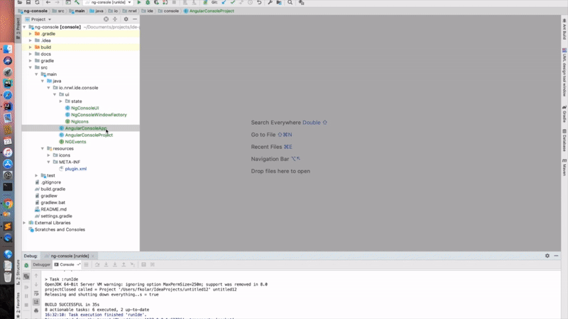

## Angular Console for Webstorm IDE

This _readme_ is only informative and has 2 purposes, it contains some of my notes and also I want to share my progress in case somebody 
wants to jump in or even to learn what I do. 
 
Later on I will try to document a few things so even you are not familier with `Intellij` plugin architecture nor `Java` 
you should be still able to navigate thru the code. 

#### Overview

After quick look I see that `Angular Console `by `nrwl.io` has two pieces:
* **UI Client** written in Angular
* **Server** that runs `Electron framework` to execute cross-platform commands directly from JavaScript. 

All this communicates using `GraphQL` channel that provides types and more reactive way of sending data to client. 


#### nrwl.io solution

They use all this setup to run both `native standalone application` as well as current `VSCode plugin`, which needs 
to startup a server to serve the client and run the server to expose GQL.

**In this case VSCode:**

* When IDE starts, I think _(I am not familiar with VSCode;-) )_  plugin is loaded and starts the internal `VSCode WebView `that access Angular served 
application. 
*  This Angular is served using `express server`

With this we create new Project, we update existing project and so on. 


## Webstorm IDE

To write a plugin for the `WebStorm` you need to have `Intellij IDEA` which has this capability and you need to know 
`Java` (or `Kotlin`). 

#### A few lines about `WebStorm`:

You can start with official [Intellij DEV Platform Guide](http://www.jetbrains.org/intellij/sdk/docs/intro/intellij_platform.html)
but to make it short, they expose certain functionality that is common across the product line (_IDEA, WEBSTORM, RUBY, ... _) and some 
that is available only for specific one.

To extend IDE functionality you write plugins and you use different concepts from the plugin SDK to access different 
part of the application (So far its pretty straight-forward).

Now let's break down some of the capability that we definitely need:

  
##### [Application Component](http://www.jetbrains.org/intellij/sdk/docs/basics/plugin_structure/plugin_components.html)

We will need to implement application component to get into startup phase where `WebStorm` is being created and 
initialized. Since `Angular Console` offers functionality to create an angular project it needs to be the first thing 
it does. 

 * Functionality to startup and serve above `Angular Console` subsystem.
 * Next to this there is one extra option called `PreloadingActivity` and `StartupActivity` to handle longer running
 tasks and blocking  operations
 
 
 ##### [Project Component](http://www.jetbrains.org/intellij/sdk/docs/basics/plugin_structure/plugin_components.html)
 
 This is another type of component to have in order to listen for `Project Opened/ Project Closed` events to re-init
  `Angular Console` and show relevant UI only for current project.
 
  
 ##### [DirectoryProjectGenerator](https://github.com/JetBrains/intellij-community/blob/master/platform/platform-impl/src/com/intellij/platform/DirectoryProjectGenerator.java)
 
 Implement specific project extensions called `DirectoryProjectGenerator` so we can extends `New Project` Wizard with our UI that is able to generate new
 project using `Angular Console`  
 
 * Usually `New Project` Wizard logic is done using  `ModuleBuilder` but this is not available for every Intellij 
 product. The `DirectoryProjectGenerator` and its specific implementations  are safe
 * Need to play with this as this flow is little bit different from regular one.
 * This will be 1st place to show `Angular Console UI`
 
 
##### JAVAFX

One of the key thing we need to be able to render a web SPA content inside Java Swing based application :
* Need to create generic window panel that can access any URL


#### [Tool Window](http://www.jetbrains.org/intellij/sdk/docs/user_interface_components/tool_windows.html)

Finally when project is opened IDE offers many areas to place your UI. We want the `ToolWindow` to place our UI. This is the
second place for our `JavaFX` panel.  

* The `ToolWindow` area are those expandable panel that on the side either left or right.

There will be definitely some other details, like threading, launching background tasks, but these 4 things above are 
probably the main one.


##### Implementation Status

I broke down the things which needs to be done into these specific tasks (areas):


- ✅ Basic plugin as **placeholder** for future code extensions + README.md
    - ✅ _Application Component_ with two entry methods (run when IDE startup and when exiting)
    - ✅ _Project Component_ with two entry methods (run when project is opened and when closed)
    - ✅ _ToolWindow_ with JavaFX functionality that can render a web page inside Swing App (e.g. http://www.google.com)
    - ❌ _ToolWindow_ implement probably different tabs for different types of commands (tasks, generate, etc..)
- ❌ _DirectoryProjectGenerator_ that shows a web page using javaFX in the New Project Wizard
    * Probably will have to create new Application type.
- ❌ Start & Stop background thread (First use simple app "hello world" generated by CLI)
    * Need to do more investigation here. I have some pointers now i need to see if they will work in practice. 
    * But for sure IDE used to use `executeOnPooledThread` for running bg theads (need to check if this still the way to 
    go)
    ```java
          ApplicationManager.getApplication().executeOnPooledThread(() ->
           {
                ApplicationManager.getApplication().runReadAction(() -> {
   
                });
            }

     ```
     * Plus if we integrate `JavaScriptLanguage` support into this plugin I see there is some functionality to work with
      npm
    
- ❌ Understand in detail how `Angular Console`  _(need assistance)_
    * How things are build for different distribution
    * Understand each npm run command and scripts
    * Available routing for new Project and existing Project
    * etcs.         
    
    
- ❌ Understand how VSCode plugin works _(need assistance)_
- ❌ Build `Angular Console` bundle and make it part of the _Plugin_ and try to start and stop the 
process inside `ApplicationComponent` 
- ❌ Make sure we have complete control over process and there is no deadlocks


 

This is the basic functionality to start with. Besides all this we will probably need some icons  
for regular and retina display also for  Dark and Light theme. 

